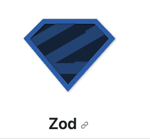

# React で Todo アプリを作る

<div></div>

<div align="center">ReactでTodoアプリを作る</div>

---

## 🎉 使用イメージ

## ⚒️ 使用技術

<p>



</p>

| スタック       | ツール名   |
| -------------- | ---------- |
| 言語           | typescript |
| ライブラリ     | React      |
| フレームワーク | Vite       |
| テストツール   | Jest       |
| バリデーション | Zod        |
| スタイル       | ChakraUI   |

## ❗️ How to Run

```bash
npm run dev
```

## ✅ How to Build

```bash
npm run build
```

## How to Test

```bash
npm run test
```
